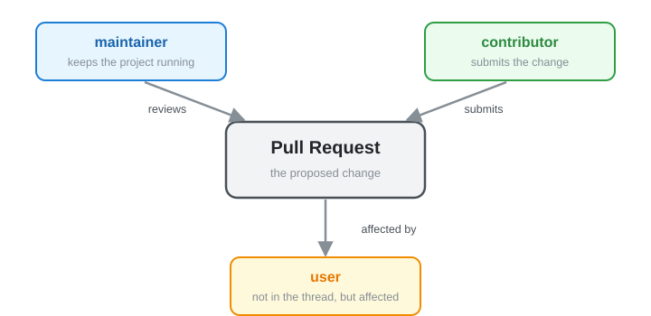
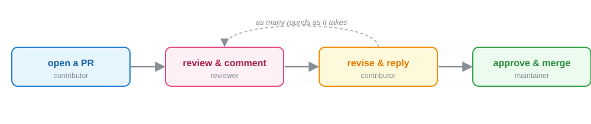
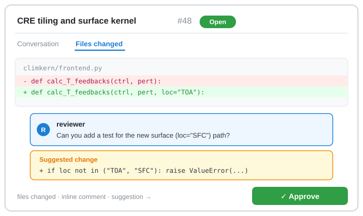

class: middle, center, title-slide
count: false

# Peer Code Review

.large.blue[Ty Janoski] 
.large[(Rutgers University)]
 
[tyler.janoski@rutgers.edu](mailto:tyler.janoski@rutgers.edu)
 

[URSSI Summer School on Research Software Development](https://github.com/si2-urssi/summerschool-June2026)

June 9th, 2026

---
# Lesson objectives

.large[
* Summarize code review best practices
* Demonstrate code review on a **real pull request** ([ClimKern #48](https://github.com/tyfolino/climkern/pull/48))
]

.footnote[
Adapted from [Madicken Munk](https://munkm.github.io/)'s 2024 URSSI lesson.
]

---
class: middle, center

# Code review best practices

---
# Why review code?

.large[
Code review, like peer review, **enhances the quality** of the work being submitted.
All involved parties are collaborating to improve the final product of the pull request.
]

--

.large[
When reviewing, you use your **expertise** to weigh in on a contribution. You won't have
expertise on everything — but your experience with the code and with *using* it is
relevant and valuable.
]

--

.large[
As the person **getting** reviewed: appreciate the reviewer taking time to give you
feedback! They are invested and interested in what you're contributing.
]

---
# Three perspectives

.center.width-60[]

.large[
* **maintainer** — keeps the project running (infrastructure, usability, the long view)
* **contributor** — submits the change; may be a first-timer or a regular
* **user** — uses the code but isn't in the thread — yet your change still affects them
]

---
# What is code review?

.large[
A structured back-and-forth to improve a change *before* it lands on `main`:
]

.center[]

.footnote[
I like [this description](https://about.gitlab.com/topics/version-control/what-is-code-review/) from GitLab.
]

---
class: middle, center

# Code review as a reviewer

---
# My approach in a review

.small[
1. **Read the PR description.** What does the author want this code to do? Is it in scope?
2. **Read the documentation** submitted with the code. Do I understand how to use it? Is
   anything ambiguous? Are docs missing?
3. **Look through the code.** Do I follow the logic? I ask questions if I don't.
4. **Check the tests.** Were tests added for new features? Do they cover the scope? Do they
   help me understand the code?
5. **Consider the user.** Is the API changing? Will it impact users significantly?
6. **Suggest constructive improvements.** Repeated logic that could be a function? A place
   for a design pattern? I add suggestions as code snippets.
7. **Try to use the feature.** Not always — but for new features I do. Any errors? Does it
   fit a real workflow?
]

I also use a checklist so I don't forget things — here's one example:
https://arfc.github.io/manual/guides/pull_requests

---
# Other considerations

.large[
* When you accept code, the contributor may not return. If you're the maintainer: is this
  code you're comfortable **maintaining** going forward?
* Adding **dependencies** should be done mindfully.
* Notice something unrelated to the PR that you'd like changed? **Open an issue** and
  suggest it as a later fix instead of blocking this PR.
]

---
# Dos in code review

.large[
* **Thank** the contributor for their contribution
* State what you **particularly like** about what was submitted
* Be **positive** whenever possible
* **Ask questions** about things you're confused about — you're probably not the only one
* If doing multiple rounds, try not to let things **stagnate**
* Use **suggestions** to show your thought process in code changes
]

---
# Don'ts in code review

.large[
* **Nitpicking** sets the tone of a review. Is this small thing really important to the
  code, or is it personal preference?
* Don't **reject** code for stylistic or tiny changes. It's very demotivating for a
  contributor.
]

---
# Tips for smoother reviews (and development!)

.small[
* Your reviews are there to **enhance** the submitted code for other maintainers,
  developers, and users. You're collaborating with the author.
* A **linter + formatter** mean reviews avoid style bikeshedding.
* Good **test coverage and CI** give contributors automatic feedback, so reviewers can
  focus on readability and applicability rather than debugging.
* Good **developer docs** (what linter/formatter? what docs style?) make the contributor
  experience less iterative.
* A clear **issue tracker** helps people other than you understand the project.
* **Labeling** issues (`good first issue`, `documentation`, `testing`, ...) lets potential
  contributors pick something they're comfortable with — and keeps contributions relevant.
* Consider a **project description** in your README. What is your code? What is it *not*?
]

---
# ClimKern is set up to make reviews easy

The project we'll review already has the infrastructure from the previous slide:

.large[
* [`.pre-commit-config.yaml`](https://github.com/tyfolino/climkern/blob/dev/.pre-commit-config.yaml) — **ruff** + **black** run automatically, so no style debates
* **CI** runs the test suite on every PR
* `climkern/tests/` with `pytest` — `pytest -v --pyargs climkern`
* A `README` that says what ClimKern *is* (and isn't)
* Labeled issues so contributors can find a good first one
]

.footnote[
Because the bots handle style and tests, the human review can focus on the *science* and
the *API*.
]

---
# Anatomy of a PR review on GitHub

.center.width-70[]

.footnote[
The pieces you'll use live: the **Files changed** tab, **inline comments** on specific lines,
a **Suggested change** (one click for the author to accept), and the **Approve** button.
]

---
class: middle, center

# Demo: reviewing a real PR

### [ClimKern #48 — "CRE tiling and surface kernel"](https://github.com/tyfolino/climkern/pull/48)

---
# The PR we'll review

.large[
[**ClimKern #48**](https://github.com/tyfolino/climkern/pull/48) — *CRE tiling and surface kernel*
by Koh Kawaguchi
]

What it claims to do (from the description):

* adds a `loc` argument to the tropospheric kernels to specify **TOA vs. surface**
* reworks the cloud radiative effect (CRE) to use `make_clim` and `tile_data`, so `ctrl`
  and `pert` can be **different sizes** (consistent with the clear-sky kernels)

Stats: **1 file** changed (`climkern/frontend.py`), **+113 / −89**, no reviews yet.

--

.large[Let's walk the 7-step approach against it, live. 👀]

---
# Walking the steps on #48

.small[
1. **Description** — Is "surface kernel support + CRE tiling" in scope for ClimKern? (Yes.)
2. **Docs** — Do the docstrings explain the new `loc` argument and its allowed values?
3. **Code** — Do I follow the `make_clim` / `tile_data` change? Where might shapes still
   mismatch?
4. **Tests** — `frontend.py` changed, but were tests added to `test_frontend.py` for the
   surface case? *(This is the kind of gap review catches.)*
5. **User impact** — Does adding `loc` change the **default** behavior for existing users
   of the TOA path? Is it backward compatible?
6. **Suggestions** — Anything repeated between the LW and SW paths that could be shared?
7. **Try it** — Run the new surface-kernel path on the tutorial data and sanity-check.
]

--

.footnote[
.blue[Note to self:] if #48 has merged by June, swap in whatever PR is open on
`tyfolino/climkern` that day — the steps are the same.
]

---
class: middle, center

# Code review as a contributor

---
# Getting your code reviewed

.large[
Getting your own code reviewed can be exciting — but also a little nerve-wracking.
Let's talk about responding to a review.
]

---
# My approach as a contributor

.large[
* **Read through** the reviewer's comments. Consider their perspective. If I don't
  understand a comment, I ask a question as a **reply** to it.
* **Answer** reviewer questions, if there are any.
* **Incorporate code suggestions** I like through the GitHub interface — this preserves
  authorship of their contributions.
* Make changes locally and push to my feature branch. Address comments in **separate
  commits** to make re-review easier.
* **Notify** the reviewer once I've addressed everything and resolved open discussions.
]

---
# A 2026 note: AI-assisted review

.large[
Tools like GitHub Copilot and Claude can now **pre-review** a PR — summarizing the diff,
flagging obvious bugs, and suggesting tests.
]

Used well, they're a **first pass** that frees humans for the judgment calls:

* ✅ great for: catching typos, missing edge cases, "did you add a test?", summarizing a
  large diff
* ⚠️ still a human's job: is this **in scope**? is the **science** right? is this an API
  I want to **maintain**?

--

.footnote[
The bot is a reviewer, not *the* reviewer. Treat its output like any other comment —
weigh it, don't rubber-stamp it. (More on this at the AI-tools panel.)
]

---
# More resources

.large[
* https://google.github.io/eng-practices/review/reviewer/
* https://stackoverflow.blog/2019/09/30/how-to-make-good-code-reviews-better/
* https://mtlynch.io/human-code-reviews-1/
* https://mtlynch.io/code-review-love/
* https://developers.redhat.com/blog/2019/07/08/10-tips-for-reviewing-code-you-dont-like
* https://kickstarter.engineering/a-guide-to-mindful-communication-in-code-reviews-48aab5282e5e
]

---
class: middle, center
count: false

# The end.

Adapted from [Madicken Munk](https://munkm.github.io/)'s 2024 URSSI lesson.
