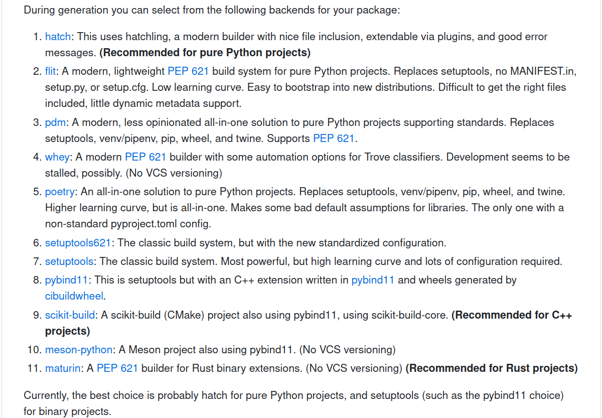
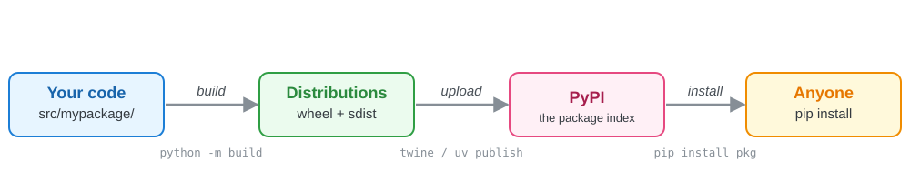
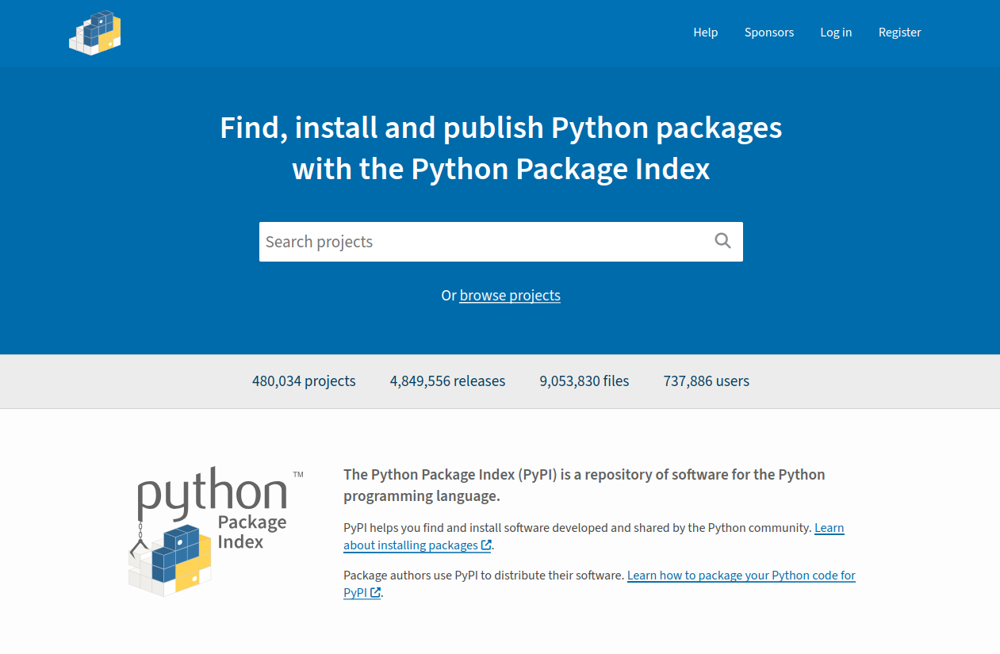
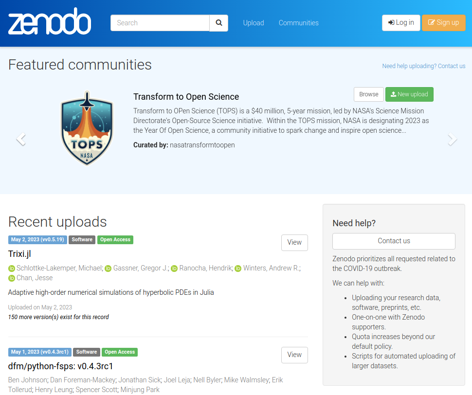
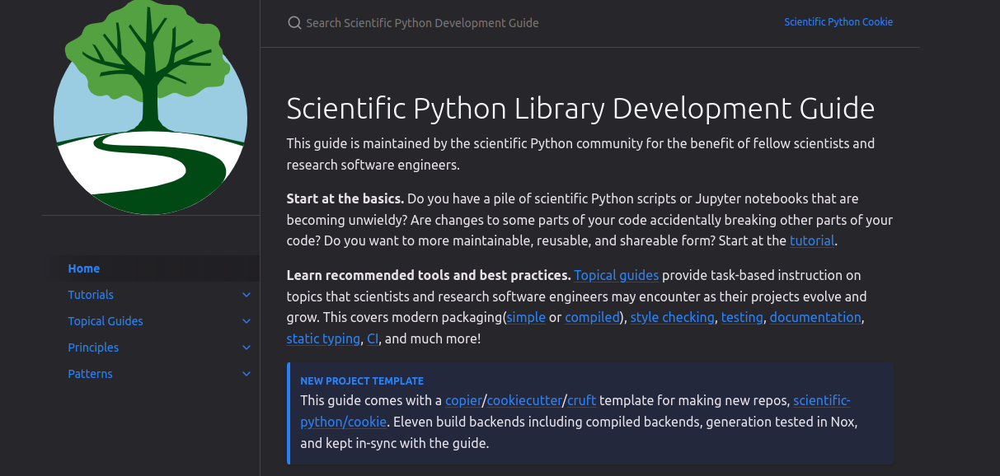

class: middle, center, title-slide
count: false

# Structuring & Distributing Python Packages:<br> Turning analyses into scientific tools

.large.blue[Ty Janoski]<br>
.large[(Rutgers University)]
<br>
[tyler.janoski@rutgers.edu](mailto:tyler.janoski@rutgers.edu)
<br>

[URSSI Summer School on Research Software Development](https://github.com/si2-urssi/summerschool-June2026)

June 8th, 2026

---
# About Me

.kol-1-2[
.large[
* Climate scientist: my work focuses on the threat of compound flooding on the NJ powergrid
* Author of [ClimKern](https://github.com/tyfolino/climkern), a Python package for
  computing radiative feedbacks with climate-model kernels
* Started as analysis scripts in 2022; now a published, citable tool used by other groups thanks to a previous iteration of this school
* I care about **reusable** open science so we can build on each other's work
]
]
.kol-1-2[
.large[
**How this talk works:**

We'll learn the mechanics on a tiny *generic* package you can copy to your own work and use ClimKern as an example.
]
]

.footnote[
Adapted, with thanks, from [Matthew Feickert](https://www.matthewfeickert.com/)'s 2024
URSSI talk and [Kyle Niemeyer](https://kyleniemeyer.github.io/research-software-dev-modules/module-packaging/)'s packaging module.
]

---
# The typical workflow

.large[
1. Work on an idea for a paper with collaborators
2. Do exploratory analysis in scripts and the Jupyter ecosystem
3. As the research progresses, you write more complicated functions and workflows
4. Code begins to **sprawl** across multiple directories
5. Software dependencies become more complicated
6. The code "works on my machine" — but what about your collaborators?
]

.center.large.bold[This is painful and not reusable.]

---
# Reusable science, step by step

.large[
In this first scenario you'll probably see a lot of `sys.path` manipulation and a
catch-all `utils.py`:
]

```python
# analysis.py
import sys
from pathlib import Path

# Make ./code/stats.py visible to Python
sys.path.insert(1, str(Path(__file__).parent / "code"))
from stats import mean   # our own helper function
```

* This is *already better* than one giant file
* But now things are tied to a relative path on *your* computer, and break the moment you
  move or rename anything

.large[We can do much better — by making our code a **package**.]

---
# First, some vocabulary

.large[
* A **module** is a single `.py` file with definitions (functions, classes, ...)
* A **package** is a directory of modules, marked by an `__init__.py`
* A **distribution** is the bundled-up package you hand to `pip` (`pip install ...`)
]

```console
mypackage/             # the project folder
└── src/
    └── mypackage/     # the package (importable)
        ├── __init__.py   # makes it a package; defines the public API
        ├── stats.py      # a module
        └── helpers.py    # another module
```

.footnote[
"Package" gets used for both *the importable folder* and *the thing on PyPI*. Usually clear
from context.
]

---
# Before packaging: manage your environment

.large[
Never install project dependencies into your system Python. **Isolate** each project so its
dependencies can't clash with another's.
]

* `python -m venv .venv` + `pip` — built in, lightweight, pure-Python
* `conda` / `mamba` — needed when dependencies aren't pure Python (compilers, C libraries)
* `pipx` / `uvx` — for installing command-line *applications* in isolation

.footnote[
A **virtual environment** is just a self-contained folder with its own Python and packages.
Activate it, and `pip install` only touches *that* project.
]

---
# Next steps: packaging your code

.huge[
* The real goal: .bold[your code becomes installable]
   - Anywhere your environment is active, you can `import mypackage`
   - No more `sys.path` hacks or "works on my machine"
]

.large[
Following the Zen of Python, this should be one obvious way, right?
]

```console
$ python -c 'import this' | grep obvious
There should be one-- and preferably only one --obvious way to do it.
```

---
# Next steps: packaging your code

.large[
Well... not quite — the ecosystem has several **build backends**:
]

<p style="text-align:center;">
   <a href="https://github.com/scientific-python/cookie">
      
   </a>
</p>

.large[
The .blue[good news]: you can almost always default to the simplest one.
]

* **pure Python**: [`hatchling`](https://hatch.pypa.io/) or [`setuptools`](https://setuptools.pypa.io/) (the classic)
* **compiled extensions** (C/C++/Fortran): [`scikit-build-core`](https://scikit-build-core.readthedocs.io/) + [`pybind11`](https://github.com/pybind/pybind11)

.footnote[
Packaging has improved *dramatically* in the last ~6 years. We'll use `hatchling` below — the
simplest modern default. (ClimKern uses `setuptools`; both are perfectly valid.)
]

---
# First: what does "building" even mean?

.large[
**Building** = turning your human-readable source code into a tidy, installable bundle.
]

.center[]

.large[
* a **wheel** (`.whl`) — a ready-to-install zip; `pip` just unzips it into place
* an **sdist** (`.tar.gz`) — your source files; `pip` builds it on the user's machine
]

.footnote[
You rarely build by hand for local work — `pip install .` does it for you. You build
explicitly when you're ready to publish.
]

---
# A clean project layout

.huge[
A modern package needs just **one** config file: [`pyproject.toml`](https://packaging.python.org/en/latest/guides/writing-pyproject-toml/).
]

```console
mypackage/
├── pyproject.toml   # the one config file (packaging + tools)
├── README.md        # what it is, how to use it
├── LICENSE          # so others can legally reuse it
└── src/
    └── mypackage/
        ├── __init__.py   # makes it a package
        └── stats.py      # your actual code
```

.footnote[
This is a **`src/` layout** — the package lives under `src/`. Copy this skeleton for your
own project and you're 90% of the way there.
]

---
# Flat vs. `src/` layout

.kol-1-2[
**Flat layout**
```console
mypackage/
├── pyproject.toml
└── mypackage/
    ├── __init__.py
    └── stats.py
```
Package sits next to the config.
]
.kol-1-2[
**`src/` layout**
```console
mypackage/
├── pyproject.toml
└── src/
    └── mypackage/
        ├── __init__.py
        └── stats.py
```
Package tucked under `src/`.
]

.large[
Both are valid! `src/` is a little safer: your tests import the **installed** package, not
whatever happens to be in the current folder — so you catch "forgot to include a file" bugs.
]

---
# Importing within your package

.large[
Inside a package, modules refer to each other with imports — two flavors:
]

```python
# src/mypackage/solvers/linear.py   — inside the "solvers" subpackage
from mypackage.stats import mean    # absolute: full path from the top
from ..stats import mean            # relative: ".." is the parent package
from .util import scale             # relative: "." is this subpackage
```

.large[
`__init__.py` decides the **public API** — what `import mypackage` actually exposes:
]

```python
# src/mypackage/__init__.py
from .stats import mean, median     # now usable as mypackage.mean
```

.footnote[
Prefer *absolute* imports for clarity; *relative* imports keep a package self-contained when
it's renamed. Pick one style and stay consistent.
]

---
# `pyproject.toml`: what is `.toml`?

.large[
> "TOML aims to be a .bold[minimal configuration file format] that's easy to read due to
> obvious semantics. TOML is designed to map unambiguously to a hash table." — https://toml.io/

A plain text format of `key = value` settings grouped under `[section]` headers — easy for
**humans** to read and **machines** to parse.
]

---
# `pyproject.toml`: how it gets built

.large[Two lines tell tools *how* to build your package:]

```toml
[build-system]
requires = ["hatchling"]              # the build backend to install
build-backend = "hatchling.build"     # ...and how to call it
```

.large[
* a **build backend** (here, `hatchling`) is the tool that *does* the building
* a **build frontend** (like `pip` or `build`) is the tool *you run*, which calls the backend
]

.footnote[
You almost never interact with the backend directly — `pip` and `build` talk to it for you.
Swap `hatchling` for `setuptools` and everything else below is identical.

.blue[In the wild:] ClimKern recently retired its old `setup.py` shim and now builds from
`pyproject.toml` alone (with `setuptools`).
]

---
# Project metadata: who & what

.large[Now the `[project]` table. Start with the **basics** — who made it and what it is:]

```toml
[project]
name = "mypackage"
version = "0.1.0"
description = "A tiny example package."
readme = "README.md"
license = "MIT"
authors = [
    {name = "Your Name", email = "you@example.com"},
]
```

.footnote[
`license = "MIT"` is an [SPDX identifier](https://spdx.org/licenses/) — a standard short
code for a license (the modern way, since PEP 639).

.blue[In the wild:] ClimKern doesn't hard-code its `version` at all — `setuptools-scm` reads
it straight from the latest `git` tag.
]

---
# Project metadata: what it needs to run

.large[Next, the package's **runtime needs**:]

```toml
requires-python = ">=3.9"

dependencies = [        # installed automatically with your package
    "numpy",
    "pandas>=2.0",
]
```

--

.large[**Optional** dependencies ("extras") users opt into:]

```toml
[project.optional-dependencies]
test = ["pytest"]       #  ->  pip install "mypackage[test]"
```

.footnote[
Pin loosely (`>=`) for a *library* so it plays nicely with others' projects.
]

---
# Project metadata: how people find it

.large[Finally, **discovery** metadata — this is what fills out your PyPI page:]

```toml
keywords = ["statistics", "research", "example"]

classifiers = [
    "Development Status :: 4 - Beta",
    "Intended Audience :: Science/Research",
    "Programming Language :: Python :: 3",
]

[project.urls]
Homepage = "https://github.com/you/mypackage"
Issues = "https://github.com/you/mypackage/issues"
```

.footnote[
**Classifiers** are standard tags ([full list](https://pypi.org/classifiers/)); **URLs**
become the handy links in the sidebar on PyPI.

.blue[In the wild:] ClimKern's latest release added exactly this block — it's what fills out
its PyPI sidebar.
]

---
# `pyproject.toml`: configuring your tools

.large[The same file configures your **dev tools** — no more one `.cfg` per tool:]

```toml
[tool.ruff]            # linter (catches bugs / style issues)
line-length = 88

[tool.pytest.ini_options]   # test runner
testpaths = ["tests"]
```

.footnote[
One file for packaging *and* your linter, formatter, test runner, type checker... it's the
center of a modern Python project.
]

---
# Installing your code

.large[With `pyproject.toml` in place, install your package into your environment:]

```console
$ cd mypackage
$ python -m pip install .
Successfully built mypackage
Successfully installed mypackage-0.1.0
```

.large[
Now `import mypackage` works anywhere your environment is active — no `sys.path`,
no relative paths.
]

---
# Packaging doesn't slow you down: editable installs

.huge[
Use an [editable install](https://pip.pypa.io/en/latest/topics/local-project-installs/#editable-installs) while developing:
]

```console
$ python -m pip install --editable .
```

.large[
This links your source folder into the environment, so **edits take effect immediately** —
no reinstall needed (unless you change `pyproject.toml`).

Develop your code and use it at the same time.
]

---
# Your first package: the whole recipe

.large[
**1.** Put your code under `src/mypackage/` with an `__init__.py`

**2.** Add a minimal `pyproject.toml`:
]

```toml
[build-system]
requires = ["hatchling"]
build-backend = "hatchling.build"

[project]
name = "mypackage"
version = "0.1.0"
```

.large[
**3.** `python -m pip install --editable .` — now `import mypackage` works anywhere
]

.center.large.bold[That's a real, installable package. Everything else builds on this.]

---
# As it grows: subpackages & data files

.kol-1-2[
.large[
A package can nest **subpackages** (each with its own `__init__.py`) and ship non-code files
right alongside the modules.
]
]
.kol-1-2[
```console
src/mypackage/
├── __init__.py
├── stats.py
├── solvers/          # a subpackage
│   ├── __init__.py
│   ├── linear.py
│   └── util.py
└── data/
    └── coeffs.csv    # bundled data
```
]

.large[
Small reference data can travel *inside* the wheel. Large data (gigabytes) is better
downloaded on demand.
]

.footnote[
.blue[In the wild:] ClimKern's kernels are multi-GB, so it *downloads* them from Zenodo
(`python -m climkern download`) instead of bundling them in the package.
]

---
# Make a module runnable: the `main()` idiom

.large[
Put your logic in functions, then guard the entry point so the file can be *imported* and
run directly:
]

```python
# src/mypackage/cli.py
def main():
    ...                        # do the work

if __name__ == "__main__":     # true only when executed, not imported
    main()
```

* `import mypackage.cli` → defines `main()`, runs nothing
* `python -m mypackage.cli` → `__name__ == "__main__"`, so `main()` fires

.footnote[
This is the hook that `[project.scripts]` (next) and ClimKern's `python -m climkern` both
rely on.
]

---
# Console commands with `[project.scripts]`

.large[
Want your package to provide a **terminal command**? Point an entry point at a function:
]

```toml
[project.scripts]
mypackage = "mypackage.cli:main"   # runs mypackage.cli.main()
```

```console
$ mypackage --help        # now available on your PATH
```

.footnote[
.blue[In the wild:] ClimKern ships a `__main__.py` so users run
`python -m climkern download` to fetch its (multi-GB) data files from Zenodo.
]

---
# Don't forget the tests

.large[
Because ClimKern is installed as a package, its tests ship with it and run anywhere:
]

```console
$ pip install "climkern[test]"
$ pytest -v --pyargs climkern
```

.large[
Good tests + CI mean a new contributor gets **automatic feedback** on whether their change
fits — which is exactly what frees up human code review (tomorrow's session!).
]

---
# The dependency reality: not everything `pip`-installs

.large[
ClimKern regrids data with [**ESMPy**](https://earthsystemmodeling.org/esmpy/), which wraps
a compiled Fortran/C++ library and is not on PyPI.
]

So its install instructions start with conda:

```console
$ conda create -n ck_env python=3.11 esmpy -c conda-forge
$ conda activate ck_env
$ pip install climkern
```

.large[
This is extremely common in scientific Python — and it's why we need **conda-forge**.
]

---
# Distributing packages: [conda-forge](https://conda-forge.org/)

.large[
The `conda` family ([`conda`](https://docs.conda.io/), [`mamba`](https://mamba.readthedocs.io/),
[`pixi`](https://prefix.dev/docs/pixi/)) are general-purpose package managers.

Instead of only Python packages, they install all dependencies (including Python and
compiled libraries) as OS- and architecture-specific **prebuilt binaries**.
]

* Popular in scientific computing because arbitrary binaries can be hosted — compilers,
  Fortran, even the full NVIDIA CUDA stack
* The trade-off: if there's no matching prebuilt binary, there's no automatic fallback to
  building from source (unlike `pip` + an sdist)

---
# Going further: distributing via Git

.large[
If your code is in a public Git repo, you've already done a version of distribution!
]

```console
# Works for pure-Python packages
$ python -m pip install "git+https://github.com/you/mypackage.git"

# General pattern (a specific branch, even)
$ python -m pip install "mypackage @ git+https://example.com/repo.git@branch"
```

.large[Great for trying a branch or an unreleased fix — but for users we want something tidier.]

---
# Building distributions: sdist & wheel

.large[
When you're ready to publish, **build** the two distribution files:
]

```console
$ python -m pip install --upgrade build
$ python -m build
Successfully built mypackage-0.1.0.tar.gz and mypackage-0.1.0-py3-none-any.whl
$ ls dist
mypackage-0.1.0-py3-none-any.whl   mypackage-0.1.0.tar.gz
```

* the **`.whl`** is the wheel (ready to install)
* the **`.tar.gz`** is the sdist (source)

---
# Uploading to a package index (PyPI)

.large[
Upload the files in `./dist/` to the [Python Package Index (PyPI)](https://pypi.org/) —
`pip`'s default index — and now *anyone* can `pip install mypackage`.
]

<p style="text-align:center;">
   <a href="https://pypi.org/project/climkern/">
      
   </a>
</p>

.footnote[
Historically you'd run `twine upload`. In 2026 there's a better way — see "What's new".
]

---
# Reproducibility: lock files

.large[
A library should support a range of dependency versions (reusable). But an
*analysis* you want to reproduce exactly needs a **lock file**: a hash-level record of every
dependency, pinned.
]

* For `pip`: [`pip-tools`](https://pip-tools.readthedocs.io/), [`uv`](https://docs.astral.sh/uv/)
* For the `conda` family: [`conda-lock`](https://conda.github.io/conda-lock/), [`pixi`](https://prefix.dev/docs/pixi/)

.large[Keep the lock file in version control alongside the analysis.]

---
# Zenodo: a versioned archive of *everything*
.center.large[code, documents, data products, data sets — each gets a DOI]

.kol-1-2[
.center.width-95[[](https://zenodo.org/)]
.center[A DOI for the project *and* each version]
]
.kol-1-2[
.large[
ClimKern's releases are archived automatically from GitHub:

**DOI:** [10.5281/zenodo.10291284](https://doi.org/10.5281/zenodo.10291284)

Tag a release → Zenodo mints a DOI → put it in your README and papers.
]
]

---
# Make your software citable: `CITATION.cff`

.large[
A [`CITATION.cff`](https://citation-file-format.github.io/) file tells GitHub (and humans)
exactly how to cite your software. GitHub adds a "Cite this repository" button.
]

```yaml
cff-version: 1.2.0
title: "ClimKern"
version: "1.2.1"
doi: "10.5281/zenodo.10291284"   # concept DOI — always resolves to latest
authors:
  - family-names: "Janoski"
    given-names: "Tyler P."
    orcid: "0000-0003-4344-355X"
contributors:                    # credit the people who helped!
  - family-names: "Linke"
    given-names: "Olivia"
    orcid: "0000-0002-5286-2185"
```

.footnote[
Software citation gets its own session on Day 3. Note the **contributors** block — when
someone lands a PR, add them here so they get credit beyond the commit log.
]

---
# Essential files beyond the code

.large[
A package is more than `.py` files. Reviewers and users look for:
]

* **README** — what it is, how to install, a usage example
* **LICENSE** — without one, others legally can't reuse it
* **CHANGELOG** — human-readable version history (semantic versioning)
* **CONTRIBUTING** — how to set up a dev environment and submit changes
* **CODE_OF_CONDUCT** — expectations for the community
* **CITATION.cff** — how to cite the software

.footnote[
You don't need all of these on day one — but a README and a LICENSE are the bare minimum to
share your work.
]

---
# A closer look: the CHANGELOG

.large[
A [CHANGELOG](https://keepachangelog.com/) is the human-readable companion to your git log —
what changed, grouped for readers, newest first.
]

```markdown
## [Unreleased]

## [1.2.1] - 2026-05-01
### Added
- `download` subcommand for fetching kernels
### Fixed
- regridding edge case at the poles
### Changed / Deprecated / Removed / Security
```

.large[
Version numbers follow [**semantic versioning**](https://semver.org/) — `MAJOR.MINOR.PATCH`,
i.e. breaking / feature / fix.
]

---
class: middle, center

# What's new in 2026

### (the field has moved since the 2024 talks)

---
# `uv`: one fast tool for the whole workflow

.large[
[`uv`](https://docs.astral.sh/uv/) (from Astral, the `ruff` folks) is a Rust-based tool
that has reshaped Python packaging since 2024 — it's *fast* and covers the whole lifecycle:
]

```console
$ uv venv                     # create a virtual environment
$ uv pip install mypackage    # a drop-in, much faster pip
$ uv add numpy                # add a dependency to pyproject.toml + lock
$ uv lock                     # write a universal lock file (uv.lock)
$ uv run pytest               # run in the project env, auto-synced
$ uv build                    # build sdist + wheel
$ uv publish                  # upload to PyPI
$ uvx ruff check .            # run a tool without installing it (like pipx)
```

.footnote[
`pip`, `hatch`, and `conda` all still work great — `uv` is an option, not a requirement.
]

---
# Publishing to PyPI in 2026

.large[
* **2FA is mandatory** on PyPI for all maintainers
* **[Trusted Publishing](https://docs.pypi.org/trusted-publishers/)** — publish straight
  from GitHub Actions using OpenID Connect, with no API tokens to manage or leak
* **PEP 740 attestations** — releases can carry signed provenance proving *which* workflow
  built them
]

.footnote[
A few lines of GitHub Actions config replaces `twine upload` and a long-lived token.
]

---
# Don't start from scratch

.large[
Use a template to set up your repo with best practices baked in:
]

* [`scientific-python/cookie`](https://github.com/scientific-python/cookie) — templates for
  11+ build backends, plus CI, linting, and docs scaffolding
* [`copier`](https://copier.readthedocs.io/) — like cookiecutter, but lets you **re-apply**
  template updates to an existing project later

```console
$ uvx copier copy gh:scientific-python/cookie my-new-package
```

---
# Recommendation: follow community guides

.large[
Packaging best practices keep changing (for the better). Instead of maintaining your own
lore, **follow and engage** with the teams building the tools.
]

<p style="text-align:center;">
   <a href="https://learn.scientific-python.org/development/">
      
   </a>
</p>
.caption[[Scientific Python Library Development Guide](https://learn.scientific-python.org/development/)]

---
# Summary

.large[
* A **package** makes your code installable, importable, and shareable — no more `sys.path`
* `pyproject.toml` is the one file at the center of it all: build backend, metadata, tools
* **Build** → wheel/sdist → **PyPI** → anyone can `pip install` it
* Real packages (like ClimKern) add tests, a license, a DOI, and citation info on top
* In 2026: `uv`, SPDX licenses, standardized lock files, and Trusted Publishing make it smoother than ever
]

.center.large.bold[Copy the `mypackage` skeleton and you've already started.]

---
# References

.large[
1. [Matthew Feickert's 2024 URSSI packaging talk](https://github.com/matthewfeickert-talks/talk-urssi-summer-school-2024)
2. [Kyle Niemeyer's packaging module](https://kyleniemeyer.github.io/research-software-dev-modules/module-packaging/)
3. [PyPA Packaging Python Projects Tutorial](https://packaging.python.org/en/latest/tutorials/packaging-projects/)
4. [Scientific Python Library Development Guide](https://learn.scientific-python.org/development/)
5. [`uv` documentation](https://docs.astral.sh/uv/)
6. [ClimKern](https://github.com/tyfolino/climkern) (the real-world example)
]

---
class: middle, center
count: false

# The end.

Copy the skeleton · `pip install mypackage` · build · publish
