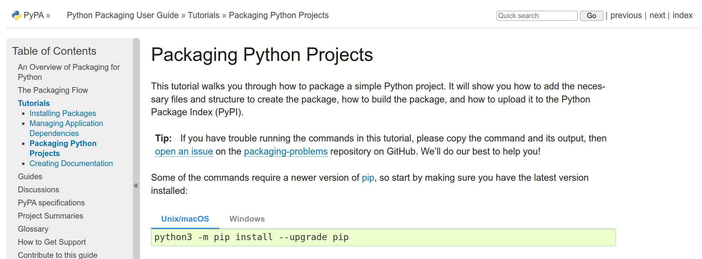
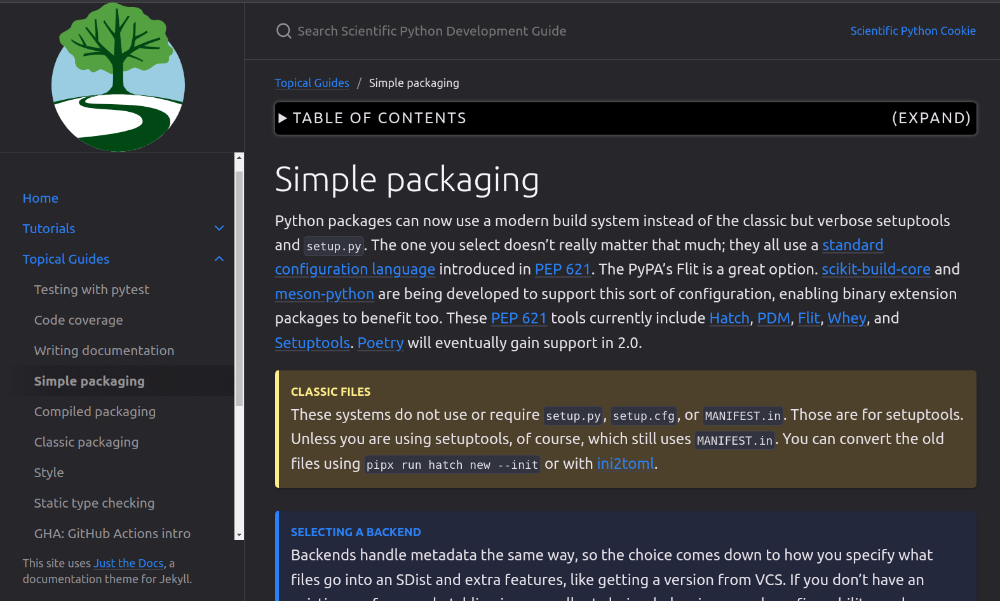

class: middle, center, title-slide
count: false

# Structuring & Distributing Python Packages:<br> Turning analyses into scientific tools

.large.blue[Ty Janoski]<br>
.large[(Rutgers University)]
<br>
[tyler.janoski@rutgers.edu](mailto:tyler.janoski@rutgers.edu)
<br>

[URSSI Summer School on Research Software Development](https://github.com/si2-urssi/summerschool-June2026)

June 8th, 2026

---
# My motivations on this topic

.kol-1-2[
.large[
* Climate scientist — I study climate feedbacks and radiative transfer
* Author of [**ClimKern**](https://github.com/tyfolino/climkern), a Python package for
  computing radiative feedbacks with climate-model kernels
* Started as analysis scripts in 2022; now a published, citable tool used by other groups
* I care about **reusable** open science so we can build on each other's work
]
]
.kol-1-2[
.large[
We'll use **ClimKern** as our running example throughout —
warts and all, it's a *real* research package, not a toy.
]

<br>

`pip install climkern`

[](https://doi.org/10.5281/zenodo.10291284)
]

.footnote[
Adapted, with thanks, from [Matthew Feickert](https://www.matthewfeickert.com/)'s 2024
URSSI talk and [Kyle Niemeyer](https://kyleniemeyer.github.io/research-software-dev-modules/module-packaging/)'s packaging module.
]

---
# The hypothetical workflow of a typical scientist

.large[
1. Work on an idea for a paper with collaborators
2. Do exploratory analysis in scripts and the Jupyter ecosystem
3. As the research progresses, you write more complicated functions and workflows
4. Code begins to **sprawl** across multiple directories
5. Software dependencies become more complicated
6. The code "works on my machine" — but what about your collaborators?
]

.center.large.bold[People heroically press forward, but this is painful, and not reusable.]

---
# Reusable science, step by step

.large[
In this first scenario you'll probably see a lot of `sys.path` manipulation and a
catch-all `utils.py`:
]

```python
# analysis.py
import sys
from pathlib import Path

# Make ./code/kernels.py visible to sys.path
sys.path.insert(1, str(Path(__file__).parent / "code"))
from kernels import calc_feedback   # our own helper
```

* This is *already better* than one massive file
* But now things are tied to a relative path on **your** computer, and are brittle to
  refactoring

.large[We can do much better!]

---
# First, some vocabulary

.large[
* A **module** is a single `.py` file containing definitions (functions, classes, ...)
* A **package** is a directory of modules, marked by an `__init__.py`
  - `__init__.py` controls what `import climkern` exposes
* A **distribution** is the packaged-up artifact you install (`pip install climkern`)
]

```console
climkern/             # the package
├── __init__.py       # makes it a package; defines the public API
├── frontend.py       # a module
├── util.py           # a module
└── tests/            # a subpackage
```

---
# Before packaging: manage your environment

.large[
Never install project dependencies into your system Python. **Isolate** each project.
]

* `python -m venv .venv` + `pip` — built in, lightweight, pure-Python
* `conda` / `mamba` — needed when dependencies aren't pure Python (compilers, C libraries)
* `pipx` / `uvx` — for installing command-line *applications* in isolation

.footnote[
ClimKern *needs* conda — more on that when we get to the dependency reality slide.
]

---
# Next steps: packaging your code

.huge[
* The real emphasis: .bold[your code becomes installable]
   - Anywhere your Python environment is active, you can `import climkern`

* Following the Zen of Python, this should be straightforward, right?
]

```console
$ python -c 'import this' | grep obvious
There should be one-- and preferably only one --obvious way to do it.
```

---
# Next steps: packaging your code

.huge[Maybe not so much. :(]

<p style="text-align:center;">
   <a href="https://github.com/scientific-python/cookie">
      
   </a>
</p>

.center.huge[You might be asking: why is there more than one?]

---
# Next steps: packaging your code

.huge[
The .blue[good news]: Python packaging has improved .bold[dramatically] in the last ~6 years
]

* It has never been easier to point a package manager at some code — locally or on the
  internet — and get working Python installed regardless of OS or architecture. A small **miracle**.

.huge[
The .red[bad news]: Python packaging has expanded .bold[dramatically] in the last ~6 years
]

* By creating standards, the PyPA enabled an ecosystem of **build backends** (good!)
* ...which means we now have to make a design choice (hard for beginners)

---
# Next steps: packaging your code

.huge[
The .green[okay news]: you can probably default to the simplest thing
]

* **pure Python**: [`setuptools`](https://setuptools.pypa.io/) (the classic default) or [`hatchling`](https://hatch.pypa.io/) (modern, lightweight)
* **compiled extensions**: [`scikit-build-core`](https://scikit-build-core.readthedocs.io/) + [`pybind11`](https://github.com/pybind/pybind11)

.kol-1-2[
<p style="text-align:center;">
   <a href="https://packaging.python.org/en/latest/tutorials/packaging-projects/">
      
   </a>
</p>
.caption[[PyPA Packaging Projects Tutorial](https://packaging.python.org/en/latest/tutorials/packaging-projects/)]
]
.kol-1-2[
<p style="text-align:center;">
   <a href="https://learn.scientific-python.org/development/guides/packaging-simple/">
      
   </a>
</p>
.caption[[Scientific Python Development Guide](https://learn.scientific-python.org/development/)]
]

.footnote[
ClimKern uses `setuptools` (+ `setuptools-scm` for versioning) — perfectly valid and still
the most common backend you'll see.
]

---
# Simple packaging example: ClimKern's layout

.huge[
Modern ([PEP 518](https://peps.python.org/pep-0518/)) build backends need a single config
file: [`pyproject.toml`](https://packaging.python.org/en/latest/guides/writing-pyproject-toml/)
]

```console
$ tree climkern
climkern
├── pyproject.toml   # controls packaging + tool config (no setup.py needed!)
├── README.md
├── LICENSE
├── CITATION.cff     # how to cite the software
├── climkern
│   ├── __init__.py  # the public API
│   ├── __main__.py  # enables `python -m climkern ...`
│   ├── frontend.py
│   ├── download.py
│   ├── util.py
│   └── tests
└── docs
```

.footnote[
This is a **flat** layout (package next to config). You'll also see a `src/` layout —
both are fine; `src/` avoids accidentally importing from the working directory.<br>
Modern `setuptools` builds from `pyproject.toml` alone — no `setup.py` shim required.
]

---
# `pyproject.toml`: what is `.toml`?

.large[
> "TOML aims to be a .bold[minimal configuration file format] that's easy to read due to
> obvious semantics. TOML is designed to map unambiguously to a hash table." — https://toml.io/

TOML has become the standard for Python config and lock files: easy for **humans** to read
and **machines** to parse.
]

---
# `pyproject.toml`: how it gets built

.huge[Defining how your project should be .bold[built]:]

```toml
[build-system]
requires = ["setuptools>=77", "setuptools-scm>=8"]
build-backend = "setuptools.build_meta"

[tool.setuptools_scm]   # version comes from your git tags
```

.footnote[
[`setuptools-scm`](https://setuptools-scm.readthedocs.io/) derives the version from your
latest git tag: tag `v1.2.1`, and the build *is* `1.2.1` — no version string to bump by
hand. (With `hatchling` you'd swap in `hatchling` / `hatch-vcs`.)
]

---
# `pyproject.toml`: metadata & requirements

.huge[Defining project .bold[metadata and dependencies]:]

```toml
[project]
name = "climkern"
dynamic = ["version"]            # set by setuptools-scm from git tags
description = "Easily compute climate feedbacks with radiative kernels."
license = "MIT"                  # SPDX expression (PEP 639)
authors = [
    {name = "Ty Janoski", email = "tyfolino@gmail.com"},
]
requires-python = ">= 3.9"
readme = "README.md"
dependencies = [
    "xarray>=0.16.2",
    "cf-xarray>=0.5.1",
    "xesmf>=0.7.1",
    "pooch",
    "plac",
    "netCDF4",
    # ...
]
```

---
# `pyproject.toml`: optional dependencies

.huge[Extra dependencies users opt into:]

```toml
[project.optional-dependencies]
test = ["pytest>=7,<8"]
lint = ["pre-commit>=2.20.0"]
```

```console
$ pip install "climkern[test]"   # install climkern + its test deps
```

.footnote[
.blue[2026 note:] there's now a *standard* way to declare dev-only dependencies that
**aren't** published as installable extras — `[dependency-groups]` (PEP 735). More later.
]

---
# `pyproject.toml`: tooling config

.huge[Configuring .bold[tools] in one place:]

```toml
[tool.ruff]
line-length = 88
target-version = "py311"
extend-select = ["E", "F", "D", "I001", "UP", "N", "B", "RUF"]

[tool.black]
line-length = 88
target-version = ["py39", "py310", "py311", "py312"]
```

.footnote[
One file configures your **linter** (ruff), **formatter** (black), test runner, type
checker, and more — instead of a `.cfg` / `.ini` per tool.
]

---
# I modernized ClimKern for this release

.large[
Presenting a *real* package means you get to watch it evolve. Here's what I actually
changed going into **v1.2.1** (all real commits you can see on GitHub):
]

| Before (v1.2) | After (v1.2.1) |
|:--|:--|
| `setup.py` shim | gone — `pyproject.toml` only |
| `version = "1.2"` (hardcoded) | `dynamic` — from git tags via `setuptools-scm` |
| no `license` field | `license = "MIT"` (SPDX, PEP 639) |
| no classifiers / URLs | full PyPI **discovery metadata** added |
| `precommit` typo in `lint` extra | fixed to `pre-commit` |

.footnote[
None of this was a rewrite — packaging best practices are a moving target, and catching up
is normal maintenance. Classifiers and URLs are what populate your PyPI page.
]

---
# Essential files beyond the code

.large[
A package is more than `.py` files. Reviewers and users look for:
]

* **README** — what it is, how to install, a usage example, license *(ClimKern ✓)*
* **LICENSE** — without one, others legally can't reuse it *(ClimKern ✓ — MIT)*
* **CHANGELOG** — human-readable version history (semantic versioning)
* **CONTRIBUTING** — how to set up a dev environment and submit changes
* **CODE_OF_CONDUCT** — expectations for the community
* **CITATION.cff** — how to cite the software *(ClimKern ✓ — more soon)*

---
# Installing your code

You can **locally install** your package into your environment:

```console
$ cd climkern
$ python -m pip install .
Successfully built climkern
Installing collected packages: climkern
Successfully installed climkern-1.2
```

...or, since ClimKern is published, anyone can just:

```console
$ pip install climkern
```

and then `import climkern` anywhere their environment is active.

---
# Packaging doesn't slow down development

.huge[
Build backends support "[editable installs](https://pip.pypa.io/en/latest/topics/local-project-installs/#editable-installs)":
]

```console
$ python -m pip install --editable .
```

.large[
Editable installs add your development files to Python's import path. You can **develop**
your code and have **immediate** access to changes — no reinstall needed (unless you change
project metadata).
]

---
# Entry points: `python -m climkern`

.large[
ClimKern's kernels live on Zenodo (too big for PyPI). A `__main__.py` lets users run the
downloader as a command:
]

```python
# climkern/__main__.py
if __name__ == "__main__":
    import sys, plac
    from .download import download

    commands = {"download": download}
    command = sys.argv.pop(1)
    plac.call(commands[command], sys.argv[1:])
```

```console
$ python -m climkern download   # fetch the kernel datasets
```

.footnote[
You can also expose true console commands via `[project.scripts]`, e.g. a `climkern`
executable on the user's `PATH`.
]

---
# Don't forget the tests

.large[
Because ClimKern is installed as a package, its tests ship with it and run anywhere:
]

```console
$ pip install "climkern[test]"
$ pytest -v --pyargs climkern
```

.large[
Good tests + CI mean a new contributor gets **automatic feedback** on whether their change
fits — which is exactly what frees up human code review (tomorrow's session!).
]

---
# The dependency reality: not everything `pip`-installs

.large[
ClimKern regrids kernels with [**ESMPy**](https://earthsystemmodeling.org/esmpy/), which
wraps a compiled Fortran/C++ library and is **not available on PyPI**.
]

So ClimKern's install instructions start with conda:

```console
$ conda create -n ck_env python=3.11 esmpy -c conda-forge
$ conda activate ck_env
$ pip install climkern
```

.large[
This is extremely common in scientific Python — and it's why we need to talk about
**conda-forge**.
]

---
# Distributing packages: [conda-forge](https://conda-forge.org/)

.large[
The `conda` family ([`conda`](https://docs.conda.io/), [`mamba`](https://mamba.readthedocs.io/),
[`pixi`](https://prefix.dev/docs/pixi/)) are **general-purpose** package managers.

Instead of only Python packages, they install **all** dependencies (including Python and
compiled libraries) as OS- and architecture-specific **built binaries** hosted on
conda-forge.
]

* Popular in scientific computing because arbitrary binaries can be hosted — compilers,
  Fortran, even the full NVIDIA CUDA stack
* The trade-off: with binaries only, if there's no matching build, there's no automatic
  fallback to building from source (unlike `pip` + sdists)

---
# Going further: distributing via Git

.large[
If your code is in a public Git repo, you've already done a version of distribution!
]

```console
# Works for pure-Python packages
$ python -m pip install "git+https://github.com/tyfolino/climkern.git"

# General pattern
$ python -m pip install "pkg @ git+https://example.com/repo.git@branch"
```

.large[Great for trying a branch or an unreleased fix — but for users we want something tidier.]

---
# Building distributions: sdist & wheel

.large[
`pip` installs two kinds of **distributions**:
]

* **[sdist](https://packaging.python.org/en/latest/glossary/#term-Source-Distribution-or-sdist)** — a `.tar.gz` of your source files
* **[wheel](https://packaging.python.org/en/latest/glossary/#term-Built-Distribution)** — a `.whl` zip of the built files + metadata (no code execution to install)

```console
$ python -m pip install --upgrade build
$ python -m build .
Successfully built climkern-1.2.tar.gz and climkern-1.2-py3-none-any.whl
$ ls dist
climkern-1.2-py3-none-any.whl  climkern-1.2.tar.gz
```

---
# Uploading to a package index (PyPI)

.large[
Upload the files in `./dist/` to the [Python Package Index (PyPI)](https://pypi.org/) —
`pip`'s default index.
]

<p style="text-align:center;">
   <a href="https://pypi.org/project/climkern/">
      
   </a>
</p>

.footnote[
Historically you'd use `twine upload`. In 2026 there's a better way — see the
"What's new" section.
]

---
# Reproducibility: lock files

.large[
Your *library* (`climkern`) should support a **range** of dependency versions
(reusable). But a specific *analysis* you want to reproduce exactly needs a **lock file**:
a hash-level record of every dependency.
]

* For `pip`: [`pip-tools`](https://pip-tools.readthedocs.io/), [`uv`](https://docs.astral.sh/uv/)
* For the `conda` family: [`conda-lock`](https://conda.github.io/conda-lock/), [`pixi`](https://prefix.dev/docs/pixi/)

Keep the lock file in version control alongside the analysis.

---
# Aside: compiled extensions

.large[
ClimKern is pure Python, but many scientific packages ship C/C++/Fortran. With modern
tooling that's only a little extra work:
]

* Swap the build backend to [`scikit-build-core`](https://scikit-build-core.readthedocs.io/) + [`pybind11`](https://github.com/pybind/pybind11)
* Add a `CMakeLists.txt`
* conda-forge (or wheels with bundled binaries) handles distribution

.footnote[
If/when you need this, the [Scientific Python guide](https://learn.scientific-python.org/development/)
walks through it end to end.
]

---
# Zenodo: a versioned archive of *everything*
.center.large[code, documents, data products, data sets — each gets a DOI]

.kol-1-2[
.center.width-95[[](https://zenodo.org/)]
.center[A DOI for the project **and** each version]
]
.kol-1-2[
.large[
ClimKern's releases are archived automatically from GitHub:

**DOI:** [10.5281/zenodo.10291284](https://doi.org/10.5281/zenodo.10291284)

Tag a release → Zenodo mints a DOI → put it in your README and papers.
]
]

---
# Make your software citable: `CITATION.cff`

.large[
A [`CITATION.cff`](https://citation-file-format.github.io/) file tells GitHub (and humans)
exactly how to cite your software. GitHub shows a "Cite this repository" button.
]

```yaml
cff-version: 1.2.0
title: "ClimKern"
version: "1.2.1"
doi: "10.5281/zenodo.10291284"   # concept DOI — always resolves to latest
authors:
  - family-names: "Janoski"
    given-names: "Tyler P."
    orcid: "0000-0003-4344-355X"
contributors:                    # credit the people who helped!
  - family-names: "Linke"
    given-names: "Olivia"
    orcid: "0000-0002-5286-2185"
preferred-citation:
  type: article
  journal: "Geoscientific Model Development"
  year: 2025
  doi: "10.5194/gmd-18-3065-2025"
```

.footnote[
Software citation gets its own session on Day 3. Note the **contributors** block — when
someone lands a PR, add them here so they get credit beyond the commit log.
]

---
class: middle, center

# What's new in 2026

### (the field has moved since the 2024 talks)

---
# `uv`: one fast tool for the whole workflow

.large[
[`uv`](https://docs.astral.sh/uv/) (from Astral, the `ruff` folks) is a Rust-based tool
that has reshaped Python packaging since 2024 — it's *fast* and covers the whole lifecycle:
]

```console
$ uv venv                     # create a virtual environment
$ uv pip install climkern     # a drop-in, much faster pip
$ uv add xarray               # add a dependency to pyproject.toml + lock
$ uv lock                     # write a universal lock file (uv.lock)
$ uv run pytest               # run in the project env, auto-synced
$ uv build                    # build sdist + wheel
$ uv publish                  # upload to PyPI
$ uvx ruff check .            # run a tool without installing it (like pipx)
```

.footnote[
`pip`, `hatch`, and `conda` all still work great — `uv` is an option, not a requirement.
]

---
# New packaging standards worth knowing

.large[
* **PEP 639** — declare your license as an [SPDX expression](https://spdx.org/licenses/):
  `license = "MIT"` + `license-files = ["LICENSE"]` (replaces the old table form and the
  license classifiers)

* **PEP 735** — `[dependency-groups]` in `pyproject.toml`: a standard way to declare
  dev/test/docs dependencies that *aren't* published as installable extras

* **PEP 751** — `pylock.toml`: a **standardized** lock-file format, so lock files aren't
  locked to one tool
]

---
# Publishing to PyPI in 2026

.large[
* **2FA is mandatory** on PyPI for all maintainers
* **[Trusted Publishing](https://docs.pypi.org/trusted-publishers/)** — publish straight
  from GitHub Actions using OpenID Connect, with **no API tokens** to manage or leak
* **PEP 740 attestations** — releases can carry signed provenance proving *which* workflow
  built them
]

.footnote[
A few lines of GitHub Actions config replaces `twine upload` and a long-lived token.
]

---
# Don't start from scratch

.large[
Use a template to set up your repo with best practices baked in:
]

* [`scientific-python/cookie`](https://github.com/scientific-python/cookie) — templates for
  11+ build backends, plus CI, linting, and docs scaffolding
* [`copier`](https://copier.readthedocs.io/) — like cookiecutter, but lets you **re-apply**
  template updates to an existing project later

```console
$ uvx copier copy gh:scientific-python/cookie my-new-package
```

---
# Recommendation: follow community guides

.large[
Packaging best practices keep changing (for the better). Instead of maintaining your own
lore, **follow and engage** with the teams building the tools.
]

<p style="text-align:center;">
   <a href="https://learn.scientific-python.org/development/">
      
   </a>
</p>
.caption[[Scientific Python Library Development Guide](https://learn.scientific-python.org/development/)]

---
# Recommendation: work with RSEs

.large[
Find and collaborate with Research Software Engineers (RSEs).

Most scientists don't get excited about packaging tools — we just want things to work.
RSEs make that easier and are *super* knowledgeable.
]

<p style="text-align:center;">
   <a href="https://society-rse.org/">
      
   </a>
</p>
.caption[[Society of Research Software Engineering](https://society-rse.org/)]

---
# Summary

.large[
* We lifted a real analysis (ClimKern) from scripts → an installable, tested, **citable** package
* Packaging is not a hopeless bog — it's community infrastructure built by people you can
  collaborate with
* `pyproject.toml` is the one file at the center of it all
* In 2026: `uv`, SPDX licenses, standardized lock files, and Trusted Publishing make it smoother than ever
* Reusable code can be a nucleation point for a community
]

---
# References

.large[
1. [Matthew Feickert's 2024 URSSI packaging talk](https://github.com/matthewfeickert-talks/talk-urssi-summer-school-2024)
2. [Kyle Niemeyer's packaging module](https://kyleniemeyer.github.io/research-software-dev-modules/module-packaging/)
3. [PyPA Packaging Python Projects Tutorial](https://packaging.python.org/en/latest/tutorials/packaging-projects/)
4. [Scientific Python Library Development Guide](https://learn.scientific-python.org/development/)
5. [`uv` documentation](https://docs.astral.sh/uv/)
6. [ClimKern](https://github.com/tyfolino/climkern) (the running example)
]

---
class: middle, center
count: false

# The end.

`pip install climkern` · [github.com/tyfolino/climkern](https://github.com/tyfolino/climkern)
